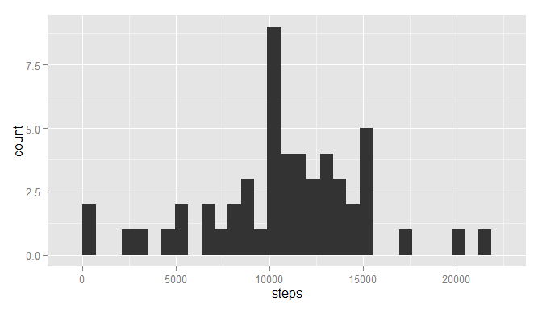
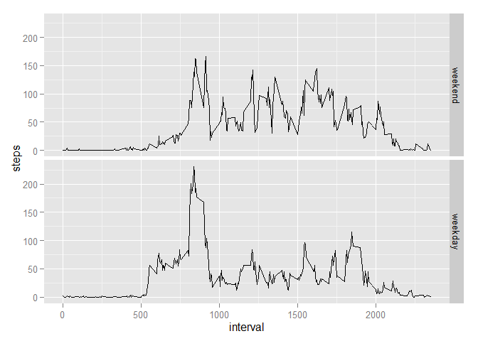

# Reproducible Research: Peer Assessment 1

## Loading and preprocessing the data

Set global option


```r
options(scipen=1, digits=2)
require(ggplot2)
```

```
## Loading required package: ggplot2
```

```
## Warning: package 'ggplot2' was built under R version 3.2.1
```

Load the data. 


```r
data <- read.csv("activity/activity.csv")
str(data)
```

```
## 'data.frame':	17568 obs. of  3 variables:
##  $ steps   : int  NA NA NA NA NA NA NA NA NA NA ...
##  $ date    : Factor w/ 61 levels "2012-10-01","2012-10-02",..: 1 1 1 1 1 1 1 1 1 1 ...
##  $ interval: int  0 5 10 15 20 25 30 35 40 45 ...
```

Transform the `date` attribute to `Date` type


```r
data$date <- as.Date(data$date)
str(data)
```

```
## 'data.frame':	17568 obs. of  3 variables:
##  $ steps   : int  NA NA NA NA NA NA NA NA NA NA ...
##  $ date    : Date, format: "2012-10-01" "2012-10-01" ...
##  $ interval: int  0 5 10 15 20 25 30 35 40 45 ...
```

## What is mean total number of steps taken per day?

Aggregate the data.frame `data` by `date` to get the total number of steps taken each day


```r
dataPerDay <- aggregate(data$steps, by = list(data$date), FUN = sum)
names(dataPerDay) <- c("date", "steps")
str(dataPerDay)
```

```
## 'data.frame':	61 obs. of  2 variables:
##  $ date : Date, format: "2012-10-01" "2012-10-02" ...
##  $ steps: int  NA 126 11352 12116 13294 15420 11015 NA 12811 9900 ...
```

Histogram of the total number of steps taken each day


```r
ggplot(data=dataPerDay, aes(steps)) + geom_histogram()
```

```
## stat_bin: binwidth defaulted to range/30. Use 'binwidth = x' to adjust this.
```

 

Calculat the **mean** and **median** total number of steps taken per day


```r
stepMean <- mean(dataPerDay$steps, na.rm = TRUE)
stepMedian <- median(dataPerDay$steps, na.rm = TRUE)
```

The **mean** total number of steps taken per day is 10766.19 and the **median** total number of steps taken per day is 10765.

## What is the average daily activity pattern?

Aggregate the data.frame `data` by `interval` to get the average number of steps taken, averaged across all days


```r
dataPerInterval = aggregate(data$steps, by = list(data$interval), FUN = mean,  na.rm=TRUE, na.action=NULL)
names(dataPerInterval) <- c("interval", "steps")
str(dataPerInterval)
```

```
## 'data.frame':	288 obs. of  2 variables:
##  $ interval: int  0 5 10 15 20 25 30 35 40 45 ...
##  $ steps   : num  1.717 0.3396 0.1321 0.1509 0.0755 ...
```

Plot the time series plot of the data.frame `dataPerInterval`


```r
ggplot(data=dataPerInterval, aes(interval, steps)) + geom_line()
```

 

Get the interval containing the maximum number of steps


```r
index <- which.max(dataPerInterval$steps)
intvl <- dataPerInterval$interval[[index]]
```

The max interval is 835.

## Imputing missing values

Get the total number of missing values in the dataset


```r
numNA <- sum(is.na(data))
```

The total number of missing values in the dataset is 2304.

We use the for that 5-minite interval to fill in all of the missing values in the dataset.

Filling the data set `dataNonNa`

```r
dataNonNa <- data
for (i in 1:length(dataNonNa$steps)){
  if (is.na(dataNonNa$steps[i])){
    j = i %% length(dataPerInterval$steps)
    if (j == 0) j = length(dataPerInterval$steps)
    dataNonNa$steps[i] <- dataPerInterval$steps[j]
  }
}
str(dataNonNa)
```

```
## 'data.frame':	17568 obs. of  3 variables:
##  $ steps   : num  1.717 0.3396 0.1321 0.1509 0.0755 ...
##  $ date    : Date, format: "2012-10-01" "2012-10-01" ...
##  $ interval: int  0 5 10 15 20 25 30 35 40 45 ...
```

Aggregate and plot the new histogram


```r
dataPerDayNonNa <- aggregate(dataNonNa$steps, by = list(dataNonNa$date), FUN = sum)
names(dataPerDayNonNa) <- c("date", "steps")
str(dataPerDayNonNa)
```

```
## 'data.frame':	61 obs. of  2 variables:
##  $ date : Date, format: "2012-10-01" "2012-10-02" ...
##  $ steps: num  10766 126 11352 12116 13294 ...
```

```r
ggplot(data=dataPerDayNonNa, aes(steps)) + geom_histogram()
```

```
## stat_bin: binwidth defaulted to range/30. Use 'binwidth = x' to adjust this.
```

 

Get the **mean** and **median** total number of steps taken per day without NAs.

```r
stepMeanNonNA <- mean(dataPerDayNonNa$steps, na.rm = TRUE)
stepMedianNonNA <- median(dataPerDayNonNa$steps, na.rm = TRUE)
```

The **mean** total number of steps taken per day without NAs is 10766.19 and the **median** total number of steps taken per day is 10766.19.
And the previous **mean** value is 10766.19 and previous **meadian** value is 10765. So we can find that the **mean** value is same because we use the the mean for that 5-minute interval to fill the NAs, and because all values of some days is all NA, so after being filled these total number of is the **mean** value so the **mean** value become the **median** value too.

## Are there differences in activity patterns between weekdays and weekends?

So we modify the `dataNonNa` for the convinience of the pattern analysis between weekdays and weekends.


```r
weekdays1 <- c('Monday', 'Tuesday', 'Wednesday', 'Thursday', 'Friday')
dataNonNa$wDay <- factor((weekdays(dataNonNa$date) %in% weekdays1), 
         levels=c(FALSE, TRUE), labels=c('weekend', 'weekday'))
str(dataNonNa)
```

```
## 'data.frame':	17568 obs. of  4 variables:
##  $ steps   : num  1.717 0.3396 0.1321 0.1509 0.0755 ...
##  $ date    : Date, format: "2012-10-01" "2012-10-01" ...
##  $ interval: int  0 5 10 15 20 25 30 35 40 45 ...
##  $ wDay    : Factor w/ 2 levels "weekend","weekday": 2 2 2 2 2 2 2 2 2 2 ...
```

Aggregate `dataNonNa` by `interval` and `wDay`


```r
dataPerIntervalNonNa <- aggregate(dataNonNa$steps, by = list(dataNonNa$interval, dataNonNa$wDay), FUN = mean)
names(dataPerIntervalNonNa) <- c("interval", "wDay", "steps")
str(dataPerIntervalNonNa)
```

```
## 'data.frame':	576 obs. of  3 variables:
##  $ interval: int  0 5 10 15 20 25 30 35 40 45 ...
##  $ wDay    : Factor w/ 2 levels "weekend","weekday": 1 1 1 1 1 1 1 1 1 1 ...
##  $ steps   : num  0.21462 0.04245 0.01651 0.01887 0.00943 ...
```

Plot the panel plot


```r
ggplot(dataPerIntervalNonNa, aes(interval, steps)) + geom_line() + facet_grid(wDay ~ .) 
```

 

From the plot we can find that steps curve has one peak more higher than others on weekdays. Instead steps curve more uniform on weekends.

